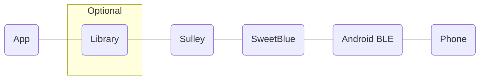
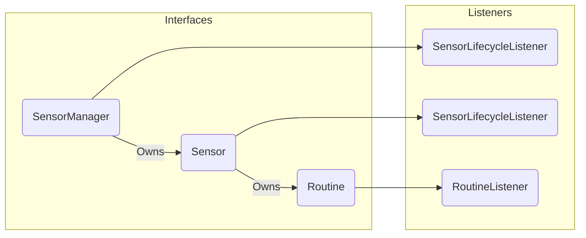
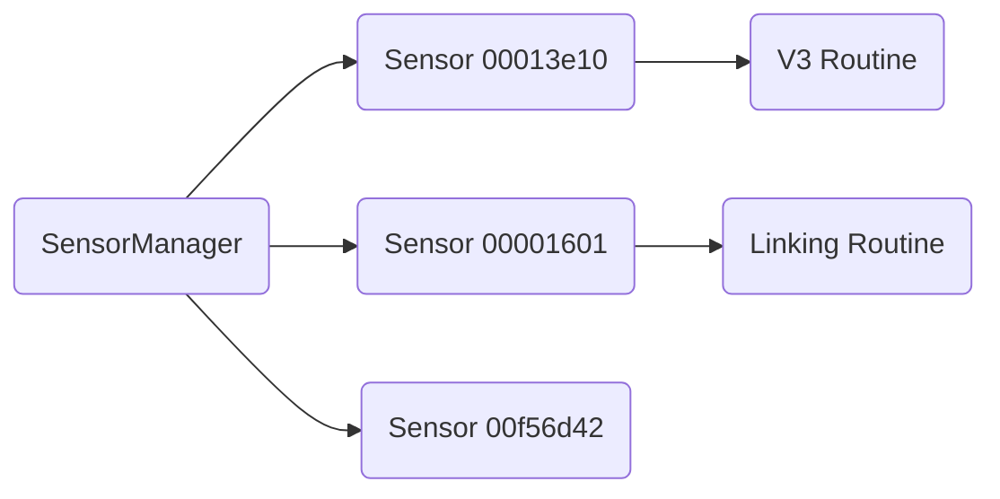
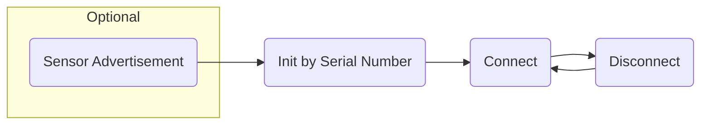
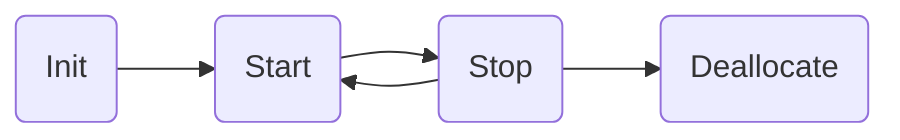
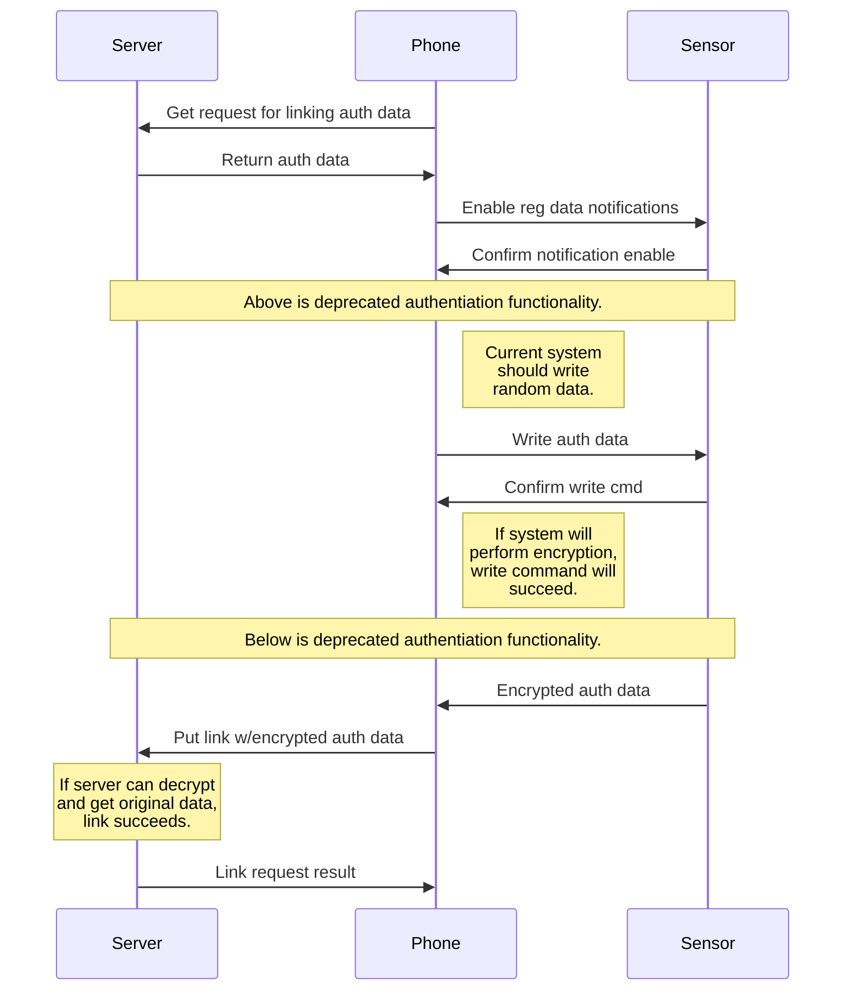

# Sulley
## Overview
Sulley is designed to act a liaison between the Android Bluetooth Low Energy API and a consumer of Blustream (or other) sensor data.  Instead of directly communicating with the Android BLE layer, Sulley uses the SweetBlue library to resolve many of the standard BLE issues that plague Android.


<details><summary>Image Source</summary>
<p>

````

````
</p>
</details>

## Goals
### Improve Testability
All helper classes and interfaces in Sulley must be unit testable.  Functional tests are just as important.  We need programmatic methods for testing connectivity during the long term, without constant monitoring.
### Create Maintainability
No code should be maintained by just one developer.  With practice, good documentation, and better programming practices, any developer should be able to debug or add new features to any layer of the Bluetooth code.  It's not allowed to be rocket science.
### Improve User's BLE Experience
Writing the library on top of SweetBlue removes many of the threading, queuing, and basic BLE issues that nearly every Android developer experiences.
### Support Future Sensors
The old version of the framework was very strict about the behavior of the framework.  In order to support other sensors, we must improve flexibility, while maintaining a very simple API.
## Public API
### Architecture

<details><summary>Image Source</summary>
<p>

````

````
</p>
</details>

#### SensorManager
At the top level, the SensorManager is the core interface.  It's comparable to Android's BluetoothAdapter or iOS's CBCentralManager.  Using it, you can start or stop scanning and listen for simple sensor events, such as advertising, connecting, or disconnecting.  It also provides access to Sensor objects (similar to a factory) without the need to wait for sensors to be detected by scanning.
#### Sensor
In the previous framework version, Device objects were very hard to maintain.  They could be created from the server or by scanning for nearby sensors.  Regularly, those two would have to be reconciled against each other and merged.  In Sulley, Sensor objects are never null!  You will always have the sensor you're looking for even before you scan for it.
#### SensorLifecycleListener
Basic types of data exist for all sensors.  Is the Sensor advertising?  Did it connect or disconnect?  Because there are times that it's easier to listen from the SensorManager (such as during linking) or from the Sensor itself (such as when driving a UI event for connecting), Sulley uses the same listener interface for both.
#### Routine
A Routine is a sequenced set of BLE operations that define a behavior for a Sensor.  For example, a routine could be defined to read data from the sensor at a regular interval.  Another routine could be to perform and over-the-air update.  An app is to a phone as a Routine is to a Sensor - Routines are purposefully flexible and vague.
Some Routines are compatible with multiple Sensors or firmware versions.  Some are not.  Depending on the app's business requirements, often a sensor's behavior must change.  The separation of a Routine and Sensor is to separate the types of data that come out of a Sensor at any given time.  It shouldn't matter what the Sensor is from the app's perspective - it matters what the sensor can do.
Routines use the command pattern, so aside from validating that a Routine can run on a sensor, Routines don't know anything about the Sensor.  Also, just because a Routine has a listener doesn't mean that you can't interact with it.  For example, often Routines require data from the app layer such as the accelerometer mode, the impact threshold, or request to blink.
#### RoutineListener
Each routine provides its own type of data.  The RoutineListener is where you can get it.  This is allows strict type-safety for listening to whatever data a routine might provide.  Gone are the days of subscribing to a notification or broadcast action, then comparing the Device's serial number, then comparing the characteristic, then going to the container to get the newest data point.  Ughh.
### Example

<details><summary>Image Source</summary>
<p>

````

````
</p>
</details>

## Lifecycles
### Sensor

<details><summary>Image Source</summary>
<p>

````

````
</p>
</details>

Internally, sensors are initialized and cached to memory when scanning is enabled.  Otherwise, the Sensor object is initialized by a request from the SensorManager given a serial number.  In either case, you can still perform connect requests on the Sensor!  This eliminates the need to scan to find a sensor before you can connect to it.  Thank you SweetBlue for making this functionality so easy!
### Routine

<details><summary>Image Source</summary>
<p>

````

````
</p>
</details>

Routines run independently of a Sensor's lifecycle.  It's up to the user or consumer on when start or stop a routine.  Routines could be programmed to automatically stop on disconnect.  Our Linking routine should stop once it fails - it's a one-time transaction.  Our v3 should automatically stop and restart on every connect and disconnect - the phone must sync the time on every connect.  I can't think of any cases where a routine should start before connecting, but it's possible.
## FAQ
### Why are there no lists of nearby or connected sensors?
They aren't needed.  The only time in our apps where we used them is for the algorithm to detect which sensor is closest.  In this case, that code turns on scanning, and then records all sensors that show up nearby in its own list.
### Can I run multiple routines at once?
No.  This was an issue we had in our previous app.  For example, in weird cases with the old BLEQueue, sometimes realtime mode or blinking would try to write to the sensor while an OTAU was preparing.  That behavior is very hard to identify and debug and impossible to test.
### Is SensorManager a singleton?
No, but it should be.  SweetBlue's code is all based on a singleton.  We'll run into trouble if we instantiate multiple SensorManagers at once.
### How do I know if a Routine will run on a Sensor?
You don't.  It's a hole in the design.  We'll need to add an API to query which routines are available for a Sensor or vise versa.
### Original Linking Design

<details><summary>Image Source</summary>
<p>

````

````
</p>
</details>

## Notes
The graphs and charts were made using [StackEdit.io](https://stackedit.io), which uses [Mermaid](https://mermaidjs.github.io/).